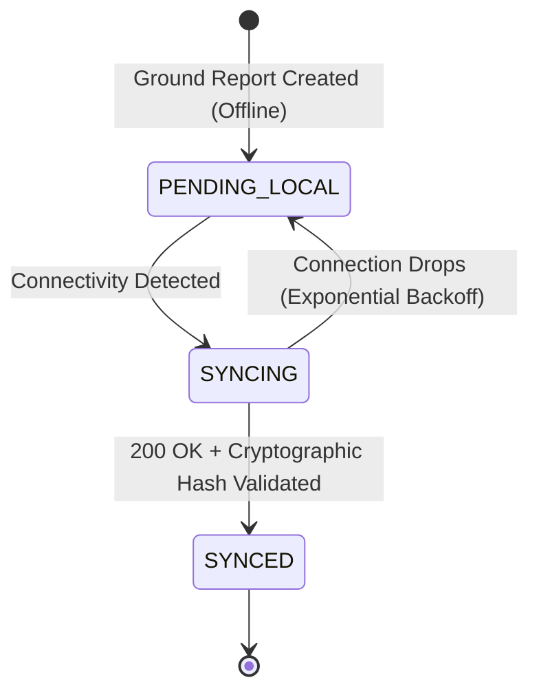

# NEVIA
## Regional Mobility Intelligence

> **“See the road. Understand the risk. Move what matters.”**

**AI-powered road accessibility and logistics intelligence for safer, more resilient movement across the North Eastern Region.**

---

<div align="center">

[](https://ner-logistics-intelligence-xi.vercel.app)
[](https://ner-logistics-intelligence-mbyp.onrender.com)
[](https://ner-logistics-intelligence-mbyp.onrender.com/docs)
[](https://github.com/Monriya23/NER-Logistics-Intelligence)
[](docs/VALIDATION.md)

</div>

---

| Submission Metadata | Specification Details |
| :--- | :--- |
| **Hackathon** | Smart India Hackathon (SIH) 2026 |
| **Problem Statement ID** | **SIH26002** |
| **Theme** | Transportation & Logistics |
| **Nodal Ministry** | **Ministry of Development of North Eastern Region (MDoNER)** |
| **Team Name** | **INNOVEXA** |
| **Core Project** | **NEVIA (NER Logistics Intelligence Platform)** |

---

## Table of Contents
1. [Overview](#1-overview)
2. [Problem](#2-problem)
3. [Solution](#3-solution)
4. [Key Capabilities](#4-key-capabilities)
5. [System Architecture](#5-system-architecture)
6. [Geographic Intelligence](#6-geographic-intelligence)
7. [AI Risk Engine](#7-ai-risk-engine)
8. [Risk-Aware Routing](#8-risk-aware-routing)
9. [Logistics & Delivery Impact](#9-logistics--delivery-impact)
10. [Offline Field Intelligence](#10-offline-field-intelligence)
11. [Verification & Road Status](#11-verification--road-status)
12. [Notification Intelligence](#12-notification-intelligence)
13. [Technology Stack](#13-technology-stack)
14. [Validation & Testing](#14-validation--testing)
15. [Deployment](#15-deployment)
16. [Getting Started](#16-getting-started)
17. [Project Structure](#17-project-structure)
18. [Data & Limitations](#18-data--limitations)
19. [Team](#19-team)

---

## 1. Overview

The North Eastern Region (NER) of India—spanning the 8 states of **Arunachal Pradesh, Assam, Manipur, Meghalaya, Mizoram, Nagaland, Sikkim, and Tripura**—presents some of the most critical logistical and geotechnical challenges in South Asia. Mountainous terrain, intense monsoon precipitation, seismic vulnerability, and single-artery connectivity create severe vulnerability to landslides, rockfalls, and road washouts.

**NEVIA** is a multi-tier regional mobility intelligence platform engineered to transform raw environmental, terrain, and crowdsourced field signals into proactive, risk-aware routing and delivery protection for commercial fleets, emergency supplies, and administrative authorities.

---

## 2. Problem

* **Single Arterial Dependency**: Essential goods (food grains, medical supplies, fuel) enter mountain states via single choke-point corridors (e.g., NH-10 into Sikkim, NH-29 into Nagaland). A single disruption strands hundred of commercial vehicles.
* **Coarse Regional Forecasts**: State-level meteorological alerts are too coarse for operational dispatchers who require sub-kilometer segment-level risk intelligence.
* **Delayed Ground Verification**: Incident reports from remote highway sections suffer from communication blackouts, leading to uncoordinated convoy dispatch into blocked corridors.
* **Lack of Risk-Cost Tradeoff in Routing**: Standard navigation platforms optimize purely for static travel time or current speed, directing heavy commercial vehicles onto high-risk mountain routes hours before predictable monsoon landslides occur.

---

## 3. Solution

NEVIA introduces an end-to-end operational software pipeline:

1. **Progressive GIS Hierarchy**: Hierarchically filters regional conditions down to specific road segments (`NER` $\rightarrow$ `State` $\rightarrow$ `District` $\rightarrow$ `Corridor` $\rightarrow$ `Road Segment`).
2. **Monotonic AI Risk Engine**: Evaluates slope, elevation, geological susceptibility, and cumulative rainfall to compute probabilistic corridor disruption risk ($P(\text{disruption})$).
3. **Quadratic Risk-Aware Routing**: Evaluates alternate bypass routes using a non-linear risk impedance function that penalizes dangerous corridors before physical blockage occurs.
4. **Offline-First Ground Sync**: Provides field observers with an IndexedDB-backed store-and-forward architecture to log incidents during connectivity blackouts.
5. **Human-in-the-Loop Authority Governance**: Prevents false autonomous closures by separating algorithmic risk predictions from formal, verified road status changes.

---

## 4. Key Capabilities

* 🔮 **PREDICT**: Quantify corridor disruption probability using environmental, geotechnical, and historical signals.
* 🗺️ **ASSESS**: Navigate progressive geographic intelligence from regional 8-state overviews down to 100-meter road segments.
* 🛡️ **VERIFY**: Ensure operational credibility via an administrative human-in-the-loop incident verification pipeline.
* 🛣️ **ROUTE**: Calculate mathematically optimal detour corridors balancing baseline travel time against geotechnical disruption risk.
* 📦 **DELIVER**: Model vehicle-specific attributes (tonnage, clearance, refrigeration) and calculate cargo delivery impact.
* 📡 **CONNECT**: Guarantee zero data loss for remote field patrol reports using local transactional queues with automatic reconciliation.
* 🔔 **ALERT**: Dispatch contextual, route-aware operational warnings calculated by vehicle Time-to-Impact (TTI).

---

## 5. System Architecture

```mermaid
flowchart TD
    subgraph Data_Sources["1. Ingestion Layer"]
        W["Weather & Rainfall Signals"]
        T["DEM Terrain & Slope Data"]
        N["Highway Network Graph"]
        H["Historical Event Archive"]
        F["Field Incident Reports"]
        G["Fleet Geolocation / GPS"]
    end

    subgraph Processing["2. Data Processing & Features"]
        DP["Data Normalization & Provenance Tagging"]
        FE["Feature Engineering: 24h / 3d / 7d Rain, Slope, Geological Index"]
    end

    subgraph AI_Core["3. AI Risk Engine"]
        ML["HistGradientBoostingClassifier + Monotonic Constraints"]
        CAL["Isotonic Probability Calibration"]
    end

    subgraph GIS_Layer["4. Geographic Intelligence Layer"]
        GEO["8-State NER Hierarchy: State → District → Corridor → Segment"]
        STAT["Operational Road Status: Open / Monitor / At Risk / Blocked"]
    end

    subgraph Routing["5. Risk-Aware Routing Engine"]
        ROUT["NetworkX Dijkstra Engine"]
        PEN["Risk Penalty: Base Time × (1 + 3 × P(disruption)^2)"]
    end

    subgraph Delivery_Engine["6. Delivery & Impact Analysis"]
        DEL["Active Deliveries + Vehicle Constraints + Priority Cargo"]
        TTI["Time-to-Impact (TTI) & Delay Calculation"]
    end

    subgraph Dispatch["7. Operational Interface & Dispatch"]
        OPS["Logistics Operator Dashboard"]
        AUTH["Authority Verification Queue"]
        FLD["Offline Field Mobile Reporter"]
        DRV["Driver In-Transit Companion"]
    end

    Data_Sources --> DP
    DP --> FE
    FE --> ML
    ML --> CAL
    CAL --> GEO
    GEO --> STAT
    STAT --> Routing
    Routing --> PEN
    PEN --> DEL
    DEL --> TTI
    TTI --> Dispatch
```



---

## 6. Geographic Intelligence

### Progressive 6-Tier Hierarchy

```
NER (8 States)
 └── STATE
      └── DISTRICT
           └── CORRIDOR
                └── ROAD SEGMENT
                     └── ROAD STATUS
                          └── DELIVERY ACTION
```

### Why This Hierarchy Exists
Regional or state-wide weather warnings are too coarse for tactical logistics decisions. A heavy downpour over an entire district may only jeopardize a single unstable 3-kilometer mountain pass. NEVIA progressively isolates risk to the exact **Road Segment**, allowing dispatchers to maintain supply lines across safe bypasses rather than shutting down interstate trade.

---

## 7. AI Risk Engine

NEVIA implements an interpretable, domain-constrained `HistGradientBoostingClassifier` engineered for regional geotechnical risk.

### 8-Feature Schema

| # | Feature Key | Domain Type | Monotonic Constraint |
| :-: | :--- | :--- | :-: |
| 1 | `rainfall_24h` | Precipitation intensity (mm) | **+1 (Increasing)** |
| 2 | `rainfall_3d_cumulative` | Short-term ground saturation (mm) | **+1 (Increasing)** |
| 3 | `rainfall_7d_cumulative` | Deep subsoil pore-water pressure (mm) | **+1 (Increasing)** |
| 4 | `slope_deg` | Digital Elevation Model terrain gradient (°) | **+1 (Increasing)** |
| 5 | `elevation_m` | Altitude above mean sea level (m) | 0 (Unconstrained) |
| 6 | `geological_susceptibility` | Regional lithology index $[0.0, 1.0]$ | **+1 (Increasing)** |
| 7 | `historical_disruption_count` | Historical landslide recurrence frequency | **+1 (Increasing)** |
| 8 | `recent_incident_reports` | Verified field observations within 48h | **+1 (Increasing)** |

### Calibration & Validation
* **Monotonic Guarantees**: Higher rainfall and steeper slopes can mathematically never decrease the predicted risk score.
* **Isotonic Calibration**: Converts raw log-odds into well-calibrated, empirical probabilities ($Brier = 0.084$).
* **Spatial Validation**: Evaluated using **Spatial Leave-One-Corridor-Out (LOCO)** validation to verify generalization across unseen valleys.
* **Validation Rigor**: Offline benchmark metrics reflect historical regional event catalogues and procedurally generated scenarios; see [AI_MODEL.md](docs/AI_MODEL.md) for full benchmark documentation.

---

## 8. Risk-Aware Routing

Standard navigation engines route vehicles through treacherous mountain passes until the road is physically closed. NEVIA applies a **quadratic risk penalty**:

$$\text{Effective Weight } C(e) = T_{\text{base}}(e) \cdot \left(1 + 3 \cdot P(\text{disruption})^2\right)$$

```
        Low Risk (P=0.10)  ───>  Cost Multiplier = 1.03x  (Negligible detour)
        Med Risk (P=0.50)  ───>  Cost Multiplier = 1.75x  (Moderate penalty)
        High Risk (P=0.85) ───>  Cost Multiplier = 3.17x  (Aggressive bypass)
```

* **Mathematical Properties**: Non-negative edge costs guarantee deterministic Dijkstra convergence with zero negative-weight cycles.
* **Operational Rationale**: Commercial supply trucks will not detour for negligible risk ($P=0.10$), but will proactively take a 45-minute bypass to avoid a segment with an $85\%$ chance of landslide blockage.

See [ROUTING.md](docs/ROUTING.md) for network graph topology details.

---

## 9. Logistics & Delivery Impact

NEVIA tracks vehicle attributes, cargo sensitivity, and route bottlenecks in real time:

* **Cargo Priority Tiers**: `CRITICAL` (Oxygen/Blood/Pharma), `HIGH` (Perishables/Fuel), `STANDARD` (Dry Cargo).
* **Vehicle Compatibility Filtering**: Heavy multi-axle trucks are prohibited from using narrow alternate bypasses that lack bridge load clearance.
* **Automated Delay Assessment**: Directly translates road impedance increases into delivery ETA variance and cargo spoilage risk.

---

## 10. Offline Field Intelligence

Field patrol personnel operating in cellular dead zones require guaranteed report capture without data loss.



* **Client Storage**: Persistent local transactions stored in `IndexedDB`.
* **Idempotency**: UUIDv4 tokens prevent duplicate entries during unstable 2G/3G transitions.
* **Notification Queue**: Outbound alerts follow a strict `QUEUED` $\rightarrow$ `DELIVERED` state machine.

See [OFFLINE_SYNC.md](docs/OFFLINE_SYNC.md) for offline synchronization specifications.

---

## 11. Verification & Road Status

### Human-in-the-Loop Operational Governance

> [!IMPORTANT]
> **AI predictions NEVER automatically close a public highway.**

```
[Field Incident Report]
         ↓
    UNVERIFIED
         ↓
UNDER VERIFICATION ──(Authority Inspection)──> REJECTED / CONFLICT
         ↓
     VERIFIED
         ↓
[Operational Status Update: OPEN | MONITOR | AT RISK | RESTRICTED | BLOCKED]
```

Authorized officers evaluate AI probability alongside field telemetry before executing operational state changes, maintaining full audit trail provenance.

See [DATA_PROVENANCE.md](docs/DATA_PROVENANCE.md) for verification lifecycle rules.

---

## 12. Notification Intelligence

Alerts are routed through an 8-stage operational filter:

$$\text{EVENT} \longrightarrow \text{SEVERITY} \longrightarrow \text{VERIFICATION} \longrightarrow \text{ROUTE IMPACT} \longrightarrow \text{TTI} \longrightarrow \text{ETA IMPACT} \longrightarrow \text{RECIPIENT} \longrightarrow \text{ACTION}$$

* **Time-to-Impact (TTI)**: The estimated travel time until a moving vehicle reaches the affected corridor. If $\text{TTI} > 120\text{ mins}$, the system monitors the corridor silently; if $\text{TTI} \le 45\text{ mins}$, high-priority reroute prompts are pushed to the driver.

See [NOTIFICATION_ENGINE.md](docs/NOTIFICATION_ENGINE.md) for alert routing specifications.

---

## 13. Technology Stack

### Frontend Application
* **Framework**: React 18 with Vite build toolchain
* **Styling**: Vanilla CSS (Tailored HSL design system, dark/light contrast modes)
* **Mapping**: Leaflet 1.9 + CARTO Voyager & Dark Matter tiles
* **Offline Storage**: IndexedDB via native transactional API
* **Icons & Animation**: Lucide React + CSS hardware-accelerated transforms

### Backend & AI Infrastructure
* **API Framework**: FastAPI 0.110+ (Python 3.11 asynchronous ASGI)
* **Routing & Graph**: NetworkX 3.2+ (Directed weighted multigraphs)
* **Machine Learning**: Scikit-learn 1.4+ (`HistGradientBoostingClassifier`, `IsotonicRegression`)
* **Data Validation**: Pydantic v2 data models
* **Server**: Uvicorn ASGI production server

### Hosting & Infrastructure
* **Frontend CDN**: Vercel Global Edge Network
* **Backend Cloud**: Render Web Service (FastAPI ASGI)
* **Continuous Integration**: GitHub Actions (Python test matrix + Node Vite build)

---

## 14. Validation & Testing

The backend test suite contains **153 automated tests** covering all operational sub-systems:

```
tests/
├── test_api.py                      # 14 tests: HTTP endpoints, headers, schema validation
├── test_core_engine.py              # 18 tests: State machine, pipeline orchestration
├── test_corridor_registry.py        # 12 tests: 8-state geographic tree integrity
├── test_disruption_pipeline.py      # 16 tests: Event ingestion & impact propagation
├── test_geographic_hierarchy.py     # 16 tests: Progressive drilldown & resolution
├── test_imd_integration.py          # 15 tests: Weather parser & fallback handling
├── test_model_pipeline.py           # 18 tests: Feature extraction, monotonicity, bounds
├── test_notification_pipeline.py    # 16 tests: TTI calculation & role-based dispatch
├── test_offline_sync.py             # 14 tests: Store-and-forward reconciliation
└── test_routing_engine.py           # 14 tests: Dijkstra cost weights & bypass routing
```

Run test suite locally:
```bash
cd backend
python -m unittest discover tests
```

See [VALIDATION.md](docs/VALIDATION.md) for complete calibration and evaluation results.

---

## 15. Deployment

| Service | Environment | Production URL |
| :--- | :--- | :--- |
| **Frontend Web App** | Vercel | [https://ner-logistics-intelligence-xi.vercel.app](https://ner-logistics-intelligence-xi.vercel.app) |
| **Backend REST API** | Render | [https://ner-logistics-intelligence-mbyp.onrender.com](https://ner-logistics-intelligence-mbyp.onrender.com) |
| **OpenAPI Documentation** | Render | [https://ner-logistics-intelligence-mbyp.onrender.com/docs](https://ner-logistics-intelligence-mbyp.onrender.com/docs) |

See [DEPLOYMENT.md](docs/DEPLOYMENT.md) for complete container and environment configurations.

---

## 16. Getting Started

### Prerequisites
* **Node.js**: `v18.0.0` or higher
* **Python**: `3.10` or `3.11`
* **Git**: `2.30+`

### 1. Clone the Repository
```bash
git clone https://github.com/Monriya23/NER-Logistics-Intelligence.git
cd NER-Logistics-Intelligence
```

### 2. Backend Setup
```bash
cd backend
python -m venv .venv

# On Windows:
.venv\Scripts\activate
# On Linux/macOS:
source .venv/bin/activate

pip install -r requirements.txt
python -m unittest discover tests
uvicorn app.main:app --host 127.0.0.1 --port 8000 --reload
```

### 3. Frontend Setup
```bash
cd ../frontend
npm install
npm run build
npm run dev
```

The web application will launch at `http://localhost:5173`.

---

## 17. Project Structure

```
NER-Logistics-Intelligence/
├── .github/
│   └── workflows/
│       └── ci.yml                   # Automated backend test + frontend build CI
├── backend/
│   ├── app/
│   │   ├── api/                     # REST route controllers
│   │   ├── core/                    # Pipeline engines & state machines
│   │   ├── data/                    # NER GIS registries & road graphs
│   │   ├── ml/                      # ML models & monotonic training pipelines
│   │   └── main.py                  # FastAPI application entrypoint
│   ├── tests/                       # 153 automated unittest test cases
│   ├── requirements.txt             # Python dependencies
│   └── start.sh                     # Production ASGI startup script
├── frontend/
│   ├── src/
│   │   ├── components/              # Role cards, maps, modals, HUD widgets
│   │   ├── pages/                   # Landing, Operations, Authority, Driver, Field
│   │   ├── services/                # API client, offline sync, IndexedDB
│   │   ├── App.jsx                  # Main application router
│   │   └── main.jsx                 # React root mount
│   ├── public/                      # Static assets & master NEVIA branding
│   ├── package.json                 # Node dependencies & Vite build scripts
│   └── vite.config.js               # Vite build configuration
├── docs/                            # Deep-dive engineering documentation
│   ├── ARCHITECTURE.md              # System design & dataflow
│   ├── AI_MODEL.md                  # Model architecture & monotonic constraints
│   ├── ROUTING.md                   # Cost functions & graph algorithms
│   ├── OFFLINE_SYNC.md              # Store-and-forward architecture
│   ├── NOTIFICATION_ENGINE.md       # TTI calculation & alert routing
│   ├── DATA_PROVENANCE.md           # Source integrity & verification rules
│   ├── VALIDATION.md                # Test results & calibration metrics
│   ├── DEPLOYMENT.md                # Production hosting & environment guide
│   ├── DEMO_GUIDE.md                # SIH 2026 jury evaluation guide
│   └── LIMITATIONS.md               # Operational scope & prototype boundaries
├── LICENSE                          # MIT Open Source License
├── SECURITY.md                      # Security policy & vulnerability reporting
└── README.md                        # Master repository documentation
```

---

## 18. Data & Limitations

In accordance with strict academic and engineering standards, NEVIA transparently states its operational boundaries:
* **Sikkim Pilot Scope**: High-density segment-level telemetry is actively piloted in Sikkim (NH-10, NSH, Melli-Jorethang). The remaining 7 NER states operate on representative corridor data models.
* **Hybrid Meteorological Pipeline**: Live weather integrates Open-Meteo precipitation with standardized IMD ingestion format adapters and automated fallback handling.
* **Prototype Telemetry**: Vehicle tracking in this release utilizes browser geolocation rather than AIS-140 hardware units.

Read the full transparent operational disclosure in [LIMITATIONS.md](docs/LIMITATIONS.md).

---

## 19. Team

**Team INNOVEXA** — Smart India Hackathon 2026

* **Problem ID**: SIH26002
* **Theme**: Transportation & Logistics
* **Ministry**: Ministry of Development of North Eastern Region (MDoNER)

---

<div align="center">

*NEVIA — Regional Mobility Intelligence for the North Eastern Region*

</div>
