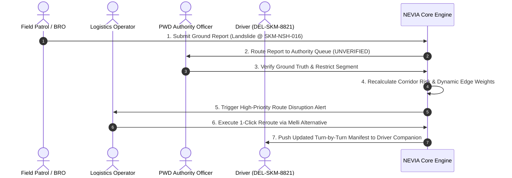

# NEVIA — Operational Demonstration & Evaluation Guide

> **Smart India Hackathon 2026** | Problem ID: **SIH26002** | Theme: **Transportation & Logistics**  
> Organization: **Ministry of Development of North Eastern Region (MDoNER)**  
> Team: **INNOVEXA** | Project: **NEVIA — Regional Mobility Intelligence**

---

## 1. Executive Summary & Live Demonstration Access

NEVIA is designed for intuitive end-to-end evaluation across **four operational roles** that reflect real-world regional logistics management in the North Eastern Region:

* **Live Web Platform**: [https://ner-logistics-intelligence-xi.vercel.app](https://ner-logistics-intelligence-xi.vercel.app)
* **Backend API & Interactive OpenAPI Docs**: [https://ner-logistics-intelligence-mbyp.onrender.com/docs](https://ner-logistics-intelligence-mbyp.onrender.com/docs)
* **Official Code Repository**: [https://github.com/Monriya23/NER-Logistics-Intelligence](https://github.com/Monriya23/NER-Logistics-Intelligence)

---

## 2. Core Evaluation Scenario: The Rangpo–Gangtok Disruption Incident

To evaluate all integrated components (AI Risk Prediction, Live GIS Hierarchy, Risk-Aware Routing, Notification Pipeline, Human Verification, and Offline Field Sync), follow the canonical evaluation scenario:

---

## 3. Step-by-Step Role Walkthrough

### Role 1: Logistics Operator (`/app?role=operations`)
* **Primary Objective**: Real-time regional overview, fleet monitoring, and active delivery tracking.
1. **Regional Overview**: Observe the 8-state North Eastern Region status overview cards.
2. **Active Pilot Selection**: Select **Sikkim** to load the active pilot corridor telemetry (NH-10, North Sikkim Highway, Melli-Jorethang).
3. **Active Deliveries**: Inspect active delivery `DEL-SKM-8821` (Medical Supplies, Siliguri $\rightarrow$ Gangtok).
4. **Disruption Assessment**: Click on the flagged corridor `SKM-NSH-016`. Inspect the **Risk Score (0.84)**, **24h Rainfall (118 mm)**, and **Terrain Slope (38°)**.
5. **Reroute Execution**: Click **"Simulate Reroute"** to trigger the Dijkstra risk-penalty engine, displaying the alternate detour with adjusted ETA and fuel impact metrics.

---

### Role 2: Regional Authority & Verification (`/app?role=authority`)
* **Primary Objective**: Human-in-the-loop verification of field intelligence and operational road status governance.
1. **Verification Queue**: Review incoming field incident reports categorized as `UNVERIFIED` / `UNDER_VERIFICATION`.
2. **Incident Inspection**: Open incident `INC-2026-0891` (Landslide debris reported at Mile 14, Gangtok North). Inspect attached field coordinates, rainfall provenance, and submitter confidence.
3. **Operational State Transition**: Update the status to `VERIFIED` and select road status `RESTRICTED`.
4. **Audit Trail Logging**: Observe that the state change is immutably logged with authority timestamp and operator ID, immediately propagating to the risk engine.

---

### Role 3: Field Operations & Ground Reporter (`/app?role=field`)
* **Primary Objective**: Low-bandwidth, offline-capable incident reporting from remote mountainous stretches.
1. **Form Input**: Enter road hazard details (Landslide, Waterlogging, or Rockfall), severity (High), and corridor segment.
2. **Offline Simulation**: In your browser DevTools, switch Network mode to **Offline**.
3. **Submit Report**: Click **"Submit Incident Report"**.
4. **Store-and-Forward**: Observe the submission banner displaying `Status: PENDING_LOCAL (Queued in IndexedDB)`.
5. **Reconnection & Sync**: Re-enable Network connectivity. Observe the background sync daemon fire, transitioning the record from `SYNCING` $\rightarrow$ `SYNCED` with zero data loss.

---

### Role 4: Driver Companion (`/app?role=driver`)
* **Primary Objective**: Lightweight, high-contrast mobile interface for in-transit commercial vehicle drivers.
1. **Trip Manifest**: Select vehicle `SK-01-D-4412` carrying Refrigerated Pharmaceuticals.
2. **Turn-by-Turn Guidance**: Review the active route path showing segment-level road conditions.
3. **Route Alert Banner**: Observe the real-time notification alert indicating impending disruption at `SKM-NSH-016` with calculated **Time-to-Impact (TTI: 42 mins)**.
4. **Actionable Directive**: Display clear detour instructions via NH-717A before the driver enters the restricted mountain stretch.

---

## 4. Key Verification Checkpoints for Evaluators

| Area | Feature | Verification Method |
| :--- | :--- | :--- |
| **Geographic Hierarchy** | Progressive filtering | Navigate NER $\rightarrow$ Sikkim $\rightarrow$ East Sikkim $\rightarrow$ NH-10 $\rightarrow$ Segment 04 |
| **AI Risk Prediction** | Monotonic Gradient Boosting | Inspect feature breakdown: rainfall + slope + elevation + historical frequency |
| **Routing Algorithm** | Quadratic Risk Avoidance | Compare shortest path (high risk) vs recommended path (detour avoiding blocked corridor) |
| **Data Provenance** | Source transparency | Check segment metadata badges: `IMD_OPENMETEO_REPRESENTATIVE`, `GEOLOGICAL_SURVEY_NER`, `FIELD_VERIFIED` |
| **Automated Tests** | Backend integrity | Execute `python -m unittest discover tests` (153/153 passing) |

---

## 5. Summary

NEVIA bridges the gap between raw environmental datasets and actionable commercial movement decisions in India's most challenging geographic terrain.
