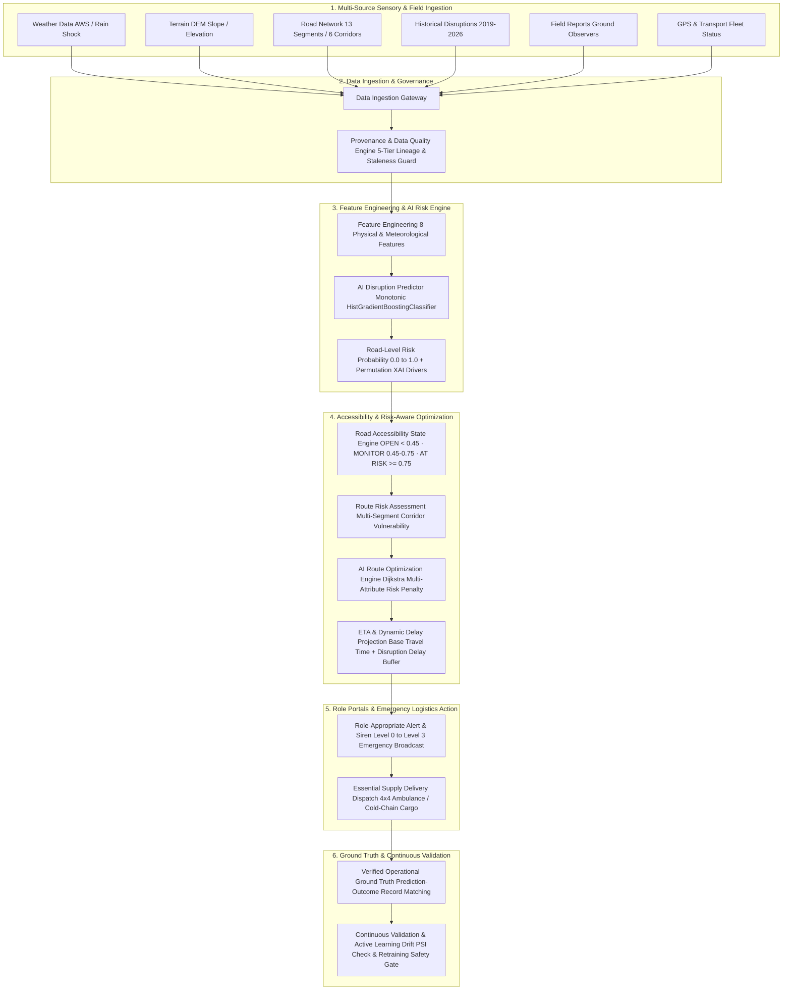

# COMPETITION ARCHITECTURE & SYSTEM DATA FLOW

**PROJECT:** AI-Based Smart Logistics and Accessibility Intelligence Platform for North Eastern Region (NER)  
**SIH PROBLEM ID:** SIH26002 | **TEAM:** INNOVEXA  
**TARGET ARCHITECTURE:** Scalable NER-Wide Multimodal Disaster Logistics  

---

## 1. Primary End-to-End Operational Intelligence Pipeline

This architecture diagram illustrates the complete factual data transformation flow: from raw environmental, terrain, and field signals through AI risk evaluation, accessibility state assignment, risk-aware routing optimization, role-specific emergency dispatch, and closed-loop operational validation.



---

## 2. Adaptive Store-and-Forward Offline Telemetry Path

This architecture diagram illustrates the resilient offline path for mountain cellular dead zones, ensuring zero data loss and preventing false transmission confirmations.

```mermaid
graph TD
    subgraph FIELD_OFFLINE["Field Officer / Driver Device in Mountain Dead Zone"]
        DEV[Field Device Mobile App / HUD]
        CACHE[Local Cache Storage IndexedDB / SQLite]
        QUEUE[Store-and-Forward Queue Status: PENDING_LOCAL]
    end

    subgraph CONNECTIVITY_DETECTION["Network Recovery & Telemetry Sync"]
        PING[Heartbeat / Connectivity Restored GOOD / INTERMITTENT]
        SYNC[Batch Synchronizer Background Adaptive Sync]
    end

    subgraph SERVER_INGESTION["Control Room Central Server"]
        SRV[FastAPI Ingestion Server Status: SYNCED]
        TRIAGE[Admin Triage Queue Duplicate Clustering & Conflict Check]
        VERIF[Administrative Authority Verification District Magistrate / Police Control]
        UPDATE[Network Graph & State Mutation Operational Road State -> BLOCKED/RESTRICTED]
        REROUTE[Dynamic Risk-Aware Reroute Driver Detour Alert Dispatched]
    end

    %% Flow
    DEV -->|1-Tap Capture with GPS & Timestamp| CACHE
    CACHE -->|Persist Locally| QUEUE
    QUEUE -.->|Offline Holding State (No Fake Confirmation)| QUEUE
    PING -->|Cellular Network Detected| SYNC
    QUEUE -->|Batch Upload Payload| SYNC
    SYNC -->|HTTP Batch Post| SRV
    SRV -->|Queue Incident| TRIAGE
    TRIAGE -->|Review Evidence & Conflict Check| VERIF
    VERIF -->|Approve Incident| UPDATE
    UPDATE -->|Trigger Real-Time Graph Recalculation| REROUTE
```

---

## 3. Core Operational Pipeline Principles

1. **Hazard $\neq$ Blocked:** Environmental hazard signals increase statistical risk ($P_{\text{disruption}}$), but only verified ground reports or executive overrides mutate operational state to `BLOCKED`.
2. **Deterministic Routing:** All-terrain routing computes both Primary Route A and Risk-Aware Route B, transparently communicating travel time trade-offs ($+33\text{ min}$) versus risk reduction ($-19.7\%$).
3. **Fail-Safe Offline Guarantee:** The platform never claims connectivity where none exists; offline records are timestamp-locked, GPS-tagged, and queued securely on-device.
