# SIH26002: AI-Based Smart Logistics & Accessibility Intelligence Platform for North Eastern Region (NER)

**Project/Team**: INNOVEXA  
**SIH Problem Statement ID**: SIH26002  
**Organization**: Ministry of Development of North Eastern Region (MDoNER)  
**Theme**: Transportation & Logistics | **Category**: Software  
**Primary Study & Data Validation Pilot**: Gangtok, Sikkim (Scalable NER-wide)

---

## 1. Core Mission & Technical Thesis

The platform addresses the central gap in North Eastern transportation:
> **"Information about weather, terrain, roads, historical disruptions, field incidents and logistics exists in different places, but this information is not sufficiently translated into road-level accessibility intelligence and actionable logistics decisions."**

### Central Innovation:
> **"We don't just predict hazards; we translate hazard, terrain, historical and field signals into road-level accessibility intelligence, risk-aware routing, delivery impact quantification, and actionable logistics decisions."**

### Continuous Intelligence Loop:
$$\mathbf{SENSE \longrightarrow PREDICT \longrightarrow ASSESS \longrightarrow DECIDE \longrightarrow DELIVER \longrightarrow LEARN}$$

```mermaid
flowchart TD
    subgraph SENSE [1. SENSE: Data Sources & Signals]
        GOV[Government Data: IMD, GSI, Sikkim DDMA, R&B]
        GIS[Authoritative Open Geospatial: OSM, DEM 30m]
        FIELD[Field Intelligence: Offline Reports, GPS, Photos]
        LOG[Logistics Telemetry: Essential Goods, Fleet Status]
    end

    subgraph PREDICT [2. PREDICT: AI / ML Disruption Engine]
        SEG[OSM Road Network Segmentation Graph]
        FE[Temporal & Spatial Feature Engineering]
        ML[Multi-Model AI: Rule Baseline, Logistic Reg, Random Forest/GBDT]
        XAI[Real Explainable AI: Feature Attribution]
    end

    subgraph ASSESS [3. ASSESS: Road Accessibility & GIS]
        P[Disruption Probability: 0.0 - 1.0]
        STATUS[Accessibility Status: OPEN / MONITOR / AT RISK / RESTRICTED / BLOCKED]
        GIS_MODES[Dual GIS Modes: Operations Mode vs Intelligence Mode]
    end

    subgraph DECIDE [4. DECIDE: Routing & Logistics Impact]
        IMPACT[Impact Engine: Affected Deliveries, Facilities & Delay]
        ROUTE[Risk-Aware Routing: Dijkstra with Risk & Block Penalties]
        ALERTS[Prioritized Actionable Alerts: Critical / Warning / Info]
    end

    subgraph DELIVER [5. DELIVER: Movement & Adaptive Connectivity]
        DISPATCH[Vehicle Matching & Dispatch]
        TRACK[Simulated GPS Tracking & Driver HUD]
        OFFLINE[Adaptive 4-State Connectivity: Good, Intermittent, Weak, Offline]
        I18N[Multilingual: EN, HI, NE, Bhutia, Lepcha]
    end

    subgraph LEARN [6. LEARN: Verified Feedback Loop]
        VERIF[Incident Triage & Temporal Duplicate Clustering]
        HIST[Historical Intelligence DB Retraining]
    end

    SENSE --> PREDICT
    PREDICT --> ASSESS
    ASSESS --> DECIDE
    DECIDE --> DELIVER
    DELIVER --> LEARN
    LEARN --> SENSE
```



---

## 2. Gangtok Government & Data Feasibility Audit

Every dataset used is categorized and transparently labeled across 4 tiers:
- `GOVERNMENT / AUTHORITATIVE`
- `OPEN GEOSPATIAL`
- `FIELD-COLLECTED`
- `SIMULATED`

| Dataset | Source Org | Type / Coverage | Key Variables | Feasibility & Use |
| :--- | :--- | :--- | :--- | :--- |
| **IMD Automatic Weather Stations** | India Meteorological Dept | `GOVERNMENT` / Gangtok Station | 24h/3d/7d/30d Rain, Intensity, Anomaly | **USE** (Feature Pipeline) |
| **GSI Landslide Susceptibility** | Geological Survey of India | `GOVERNMENT` / Sikkim Hills | Susceptibility Index (Low/Mod/High/Very High) | **USE** (Spatial Overlay & ML) |
| **Sikkim DDMA & R&B Records** | Sikkim Govt / District Admin | `GOVERNMENT` / NH-10 & Corridors | Historical Blockages, Road Damage, Duration | **USE** (Historical Disruption DB) |
| **OpenStreetMap Road Network** | OpenStreetMap / Overpass | `OPEN GEOSPATIAL` / Gangtok & North Sikkim | Way Geometries, Road Types, Junctions | **USE** (Segment Graph) |
| **SRTM 30m Digital Elevation** | NASA / ISRO Bhuvan | `OPEN GEOSPATIAL` / Sikkim DEM | Elevation (m), Slope (°), Aspect | **USE** (Terrain Feature Extractor) |
| **Field Officer Incident Logs** | Field App / Offline Queue | `FIELD-COLLECTED` / Ground Officers | GPS, Photos, Severity, Incident Type | **USE** (Real-time Ground Truth) |
| **Fleet & Disruption Injections** | SIH Simulator Engine | `SIMULATED` / Pilot Run | Vehicle Telemetry, Rain Spike Trigger | **SUPPORT** (Controlled Demo) |

---

## 3. Detailed Architectural & Technical Specifications

### A. Backend Architecture (`backend/app/`)
1. **GIS Road Network Segmentation (`backend/app/gis/`)**:
   - `road_network.py`: Generates indexed road segments for Gangtok and key North Eastern corridors (e.g., Gangtok-Mangan-Chungthang NH-10 / North Sikkim Highway, Gangtok-Dikchu bypass, Gangtok-Singtam-Rangpo, Deorali-Tadong, Indira Bypass).
   - Each segment contains: `segment_id`, `name`, `start_node`, `end_node`, `length_km`, `road_type`, `avg_slope_deg`, `elevation_m`, `gsi_susceptibility`, `historical_blockage_count`, `surface_condition`, `geometry_coords`.
   - `routing_engine.py`: NetworkX graph routing implementing the risk-aware cost equation:
     $$\text{Cost}(e) = \text{TravelTime}(e) \times \left(1 + \lambda \cdot \text{RiskScore}(e)^2\right) + \text{BlockedPenalty}(e)$$
     Computes Fastest Route vs Lower-Risk Route with side-by-side trade-off metrics.

2. **AI / ML Disruption Engine (`backend/app/ai/`)**:
   - `dataset_generator.py`: Generates the structured training matrix mapped to road segments over temporal windows (2019–2026), with features: `rain_24h`, `rain_3d`, `rain_7d`, `rain_30d`, `slope_deg`, `elevation_m`, `susceptibility_score`, `historical_event_count`, `recent_field_reports_count`, `target_disrupted`.
   - `model_trainer.py`:
     - **Baseline**: Rule-based heuristic risk index.
     - **Model 1**: Logistic Regression (transparent linear baseline with explicit feature log-odds).
     - **Model 2**: Random Forest Classifier (ensemble tree baseline).
     - **Model 3**: Gradient Boosting (XGBoost/HistGradientBoosting) with class-weighting.
     - **Validation**: Strict **Time-Aware Temporal Split** (Past $\to$ Train, Middle $\to$ Validation, Recent $\to$ Test).
     - **Evaluation**: Precision, Recall, F1-Score, PR-AUC, Brier Score / Calibration.
   - `explainability.py`: Dynamically extracts true feature contributions ($w_i \cdot x_i$) for any given prediction, explaining exactly why a road is high risk (e.g. Rain 24h: 120mm, Slope: 36°, GSI High Susceptibility).

3. **Logistics & Impact Analysis (`backend/app/logistics/`)**:
   - `inventory.py`: Essential commodities: Medicines (Anti-venom, Insulin, Trauma kits, Dialysis fluids), Food grains, Agri produce (Cardamom, Ginger), Construction/Road repair aggregate, Emergency blankets.
   - `fleet.py`: Vehicles (4x4 Hill Ambulances, Heavy 6x6 Logistics Trucks, Mahindra Bolero Pickups, Tata 407s).
   - `impact_analyzer.py`: When a road segment transitions to `AT RISK` / `RESTRICTED` / `BLOCKED`:
     - Identifies all active deliveries passing through that segment.
     - Identifies affected healthcare facilities (e.g., Chungthang PHC, Mangan District Hospital).
     - Calculates projected delay and automated rerouting suggestions.

4. **Field Intelligence & Adaptive Store-and-Forward (`backend/app/field/`)**:
   - `incidents.py`: Incident reports (`ROAD_BLOCKED`, `LANDSLIDE`, `FLOOD`, `BRIDGE_DAMAGE`, `ROAD_DAMAGE`, `TRAFFIC_CONGESTION`).
   - `verification.py`: Administrative verification state machine (`Reported` $\to$ `Under Verification` $\to$ `Verified` / `Rejected`).
   - Duplicate detection engine: Clusters reports sharing the same `segment_id` within a 4-hour temporal window.
   - `sync_service.py`: Store-and-forward sync protocol with delta reconciliation.

5. **Multilingual System (`backend/app/i18n/`)**:
   - Comprehensive translation dictionaries for English, Hindi, Nepali, Bhutia/Sikkimese, and Lepcha covering emergency alerts, road status, field forms, driver instructions, and UI labels.

6. **Interactive SIH Demo Scenario Runner (`backend/app/simulation/`)**:
   - Step-by-step orchestrator for the **Emergency Medicine Delivery from Gangtok Central Medical Store to Chungthang PHC via Mangan**.

---

### B. Frontend Architecture (`frontend/src/`)
1. **Interactive GIS Map (`OperationalMap.jsx`) with Dual Modes**:
   - **OPERATIONS MODE**: High-contrast operational map with color-coded road accessibility (`OPEN` 🟢, `MONITOR` 🟡, `AT RISK` 🟠, `RESTRICTED` 🟣, `BLOCKED` 🔴), live vehicle markers with pulsing trails, active delivery routes (Primary vs Alternate), incident pins, and hospital/supply points.
   - **INTELLIGENCE MODE**: Scientific GIS view with rainfall intensity contours, terrain slope gradient, GSI landslide susceptibility heatmap, historical incident density, and AI disruption probability overlays.
   - **Historical Map Playback**: Interactive timeline slider (2019 $\to$ 2026) to replay historical disruptions across Sikkim corridors.
   - **Layer Selector**: Independent toggles for Roads, Risk, Rain, Slope, Susceptibility, Incidents, Vehicles, Deliveries, Hospitals, Supply Points.

2. **Core Operational Portals & Views**:
   - **🎛️ Logistics Command Center (`ControlCenterView.jsx`)**: Real-time regional overview, network operational health (e.g. 92% Operational), active deliveries list, bottleneck corridor cards, critical alerts drawer, quick search.
   - **🗺️ Road Intelligence Explorer (`RoadIntelligenceView.jsx`)**: Segment-by-segment deep dive, model performance dashboard (PR-AUC, F1, calibration curves), interactive XAI feature attribution drawer, terrain profile.
   - **🚚 Delivery & Route Hub (`DeliveriesView.jsx`)**: End-to-end delivery tracking, visual multi-stage timeline, side-by-side Route A vs Route B trade-off comparison, delay estimator.
   - **📱 Field Officer Portal (`FieldOfficerPortal.jsx`)**: Mobile-first interface with large 1-tap emergency action buttons, GPS auto-tag, camera/photo capture, offline queue indicator, and auto-sync trigger.
   - **🧭 Driver Companion HUD (`DriverCompanionHUD.jsx`)**: Minimal-distraction dashboard with road warnings, 1-click alternative route acceptance, milestone updates, and SOS button.
   - **🛡️ Admin Verification Center (`AdminVerificationView.jsx`)**: Report triage queue, duplicate cluster inspector, confidence scoring, 1-click road status override.
   - **📊 Operational Analytics (`AnalyticsView.jsx`)**: Corridor risk statistics, disruption causes, delay patterns, sync performance.
   - **🌐 Government Showcase Landing Page (`LandingPage.jsx`)**: High-impact MDoNER presentation landing page.

3. **Adaptive Connectivity Engine (`ConnectivityContext.jsx`)**:
   - Supports 4 dynamic states: 🟢 `GOOD`, 🟡 `INTERMITTENT`, 🟠 `VERY WEAK`, 🔴 `OFFLINE`.
   - IndexedDB / localStorage store-and-forward queue with pending count badge (`PENDING` $\to$ `SYNCING` $\to$ `SYNCED`).
   - Last-Known Intelligence banner: "Road Status: AT RISK • Synced 18 min ago • Source: Sikkim DDMA • Confidence: High".

---

## 4. 18-Phase Implementation & Verification Plan

```text
Phase 1:  Gangtok Government & Authoritative Data Feasibility Audit
Phase 2:  Road Network & GIS Base (Gangtok & North Sikkim Corridors)
Phase 3:  Terrain, Elevation & Slope Derivation (DEM 30m)
Phase 4:  Rainfall & Environmental Temporal Intelligence (24h/3d/7d/30d)
Phase 5:  Historical Disruption Dataset & Corridor Mapping (2019-2026)
Phase 6:  Master Road-Segment Feature Matrix & Label Alignment
Phase 7:  Rule-Based Baseline Risk Model
Phase 8:  AI/ML Model Training, Time-Aware Split & Calibration Evaluation
Phase 9:  Explainable AI (XAI) Feature Attribution Engine
Phase 10: Road Accessibility State Engine (Prediction vs Verified Status)
Phase 11: Risk-Aware Routing Engine (Dijkstra + Cost Penalties + Alternate Routes)
Phase 12: Logistics Impact Analysis, Inventory & Fleet Matching
Phase 13: Adaptive 4-State Store-and-Forward Field Intelligence Engine
Phase 14: Multilingual Dictionary (EN, HI, NE, Bhutia, Lepcha)
Phase 15: FastAPI REST Backend Service Integration
Phase 16: React + Leaflet Dual-Mode Operational GIS Frontend
Phase 17: Interactive 22-Step SIH Emergency Medicine Disruption Scenario
Phase 18: Full Stack Automated Testing, Verification & Walkthrough
```

### Automated Verification
- Run backend pytest suite on AI models, routing engine, logistics impact, duplicate clustering, and i18n completeness.
- Run frontend production build check (`npm run build`).

### Interactive Manual Verification
- Execute full guided emergency medicine delivery simulation with live rainfall spike, landslide injection, offline field report sync, administrative verification, and risk-aware rerouting.
